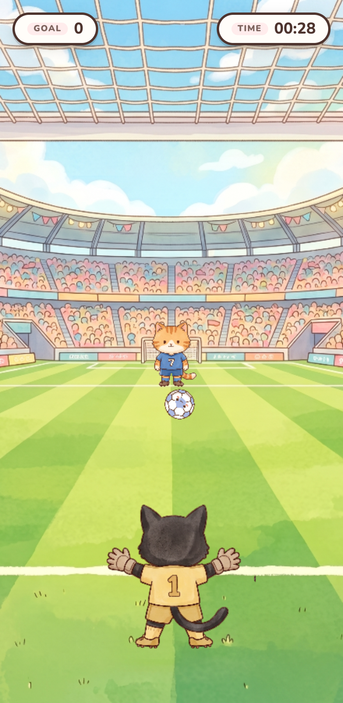

# Football Save ⚽ — Cat Goalkeeper Game

A delightful HTML5 web-based football goalkeeper game featuring adorable cats. The orange cat (striker) shoots the ball in various trajectories, and you must control the black cat (goalkeeper) to save the goals!

<p align="center">
  
</p>

## 🎮 Screenshot

<p align="center">
  
</p>

---

## 🚀 Features

*   **Charming Hand-Drawn Art Style**: Adorable designs for the orange cat striker, black cat goalkeeper, and dynamic stadium background.
*   **Real-time Physics & Animations**: Smooth ball shooting paths, goalkeeper diving, and miss animations powered by Phaser.
*   **Global Live Leaderboard**: Integrated with Firebase Firestore to store, retrieve, and showcase the top global high scores in real time.
*   **Multi-language Support (i18n)**: Built-in localization support via i18next, automatically matching or manually switching the language (Traditional Chinese, English, etc.).
*   **Logo Easter Eggs**: Clicking the logo on the home screen toggles cute random cat faces (normal, angry, shocked).
*   **Local High Score Tracking**: Uses Local Storage to persist your personal best score, giving you a target to beat every time you play.

---

## 🛠️ Tech Stack

*   **Game Engine**: [Phaser 4](https://phaser.io/) — Handles 2D rendering, sprite sheets, animations, and game physics.
*   **Frontend Framework**: [React 19](https://react.dev/) — Manages start menu overlays, game over screens, leaderboards, and UI states.
*   **Language**: [TypeScript](https://www.typescriptlang.org/) — Ensures type safety, robust development, and code maintainability.
*   **Styling**: [Tailwind CSS v4](https://tailwindcss.com/) — Accelerates layout creation for responsive, clean, and modern components.
*   **Localization**: [i18next](https://www.i18next.com/) & [react-i18next](https://react.i18next.com/) — Provides multilingual integration.
*   **Backend / Database**: [Firebase Firestore](https://firebase.google.com/) — Stores and synchronizes real-time global leaderboard data.
*   **Build Tool**: [Vite](https://vite.dev/) — Provides ultra-fast Hot Module Replacement (HMR) during development and optimized production builds.
*   **Linter**: [Oxlint](https://oxc.rs/) — A blazing fast Rust-based linter.

---

## 📦 Development

### 1. Install Dependencies
```bash
npm install
```

### 2. Environment Variables Setup
Create a `.env.local` file in the root directory (refer to `.env.example`) and fill in your Firebase configuration:
```env
VITE_FIREBASE_API_KEY=YOUR_API_KEY
VITE_FIREBASE_AUTH_DOMAIN=YOUR_AUTH_DOMAIN
VITE_FIREBASE_PROJECT_ID=YOUR_PROJECT_ID
VITE_FIREBASE_STORAGE_BUCKET=YOUR_STORAGE_BUCKET
VITE_FIREBASE_MESSAGING_SENDER_ID=YOUR_MESSAGING_SENDER_ID
VITE_FIREBASE_APP_ID=YOUR_APP_ID
```
> **Note**: If Firebase is not configured, the game remains fully playable, but the global leaderboard features will be disabled (fallback to a read-only or placeholder state).

### 3. Run Development Server
```bash
npm run dev
```
Open `http://localhost:5173/` in your browser to play and test.

### 4. Build for Production
```bash
npm run build
```
The optimized production files will be output to the `dist` directory.

### 5. Lint Code
```bash
npm run lint
```

---

## 🏗️ Architecture & Communication

This project implements a clean separation of concerns between **React (UI/Overlay States)** and **Phaser (Game Core/Loop)**. They communicate bidirectionally using a custom **`EventBus`**:

*   **React ➡️ Phaser**: When the player clicks "Start Game" or "Restart Game," React emits the `start-game` or `restart-game` event to instruct Phaser to initiate the match.
*   **Phaser ➡️ React**: During gameplay, Phaser emits `update-score` and `update-timer` events to feed live score/time data to React. When the game ends, Phaser emits `game-over` to trigger the game-over screen and leaderboard submit overlays.

Refer to [src/game/EventBus.ts](src/game/EventBus.ts) for event registration details.
